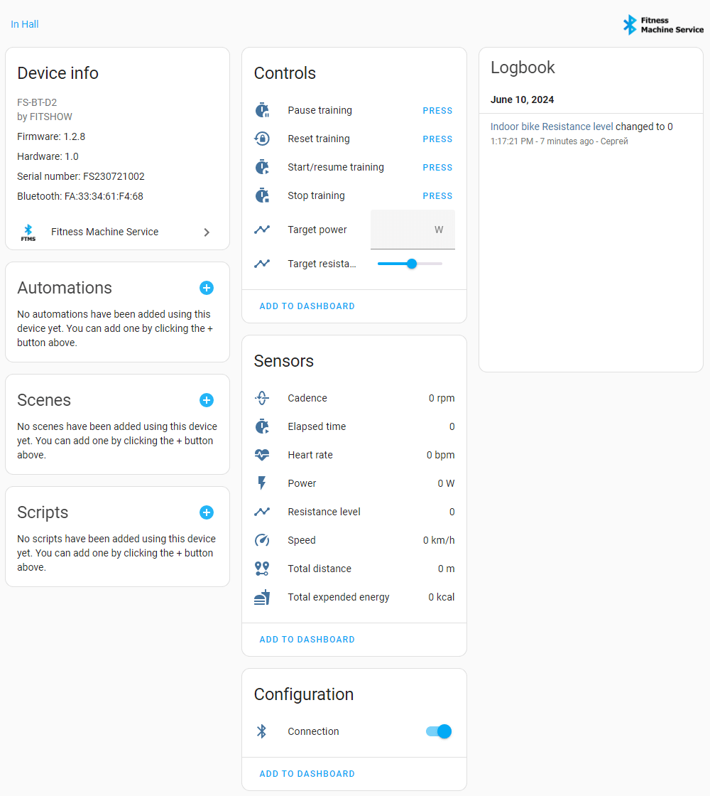

# Fitness Machine Service

[Home Assistant](https://www.home-assistant.io/) [HACS](https://hacs.xyz/) custom component for working with fitness equipment with a Bluetooth interface.

The component is based on the [pyftms](https://github.com/dudanov/pyftms) library, which complies with the [Bluetooth Fitness Machine Service v1.0 standard](https://www.bluetooth.com/specifications/specs/fitness-machine-service-1-0/).

Component capabilities:

1. Automatically detect Bluetooth fitness devices nearby, notifying the user about it;
2. Setup Wizard, which allows you to easily configure the device by determining its type and set of sensors in automatic or manual modes. The set of sensors can be changed.

Device view example for `Indoor bike` fitness machine:

